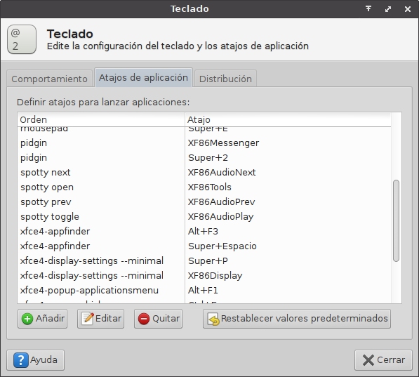

# Spotty


Spotty allows you to control Spotify from the terminal or assign its commands
to a keyboard shortcut.

## Play / Pause

To pause the current song:

```sh
spotty pause
```

To play the current song:

```sh
spotty play
```

To play or pause the current song:

```sh
spotty toggle
```

## Songs

To play the next song in the playlist:

```sh
spotty next
```

To play the previous song in the playlist:

```sh
spotty prev
```

# Xubuntu Keyboard shortcuts

It is only tested on xubuntu but it should work everywhere.



Made with ❤ by ROJO 2 (http://rojo2.com)
